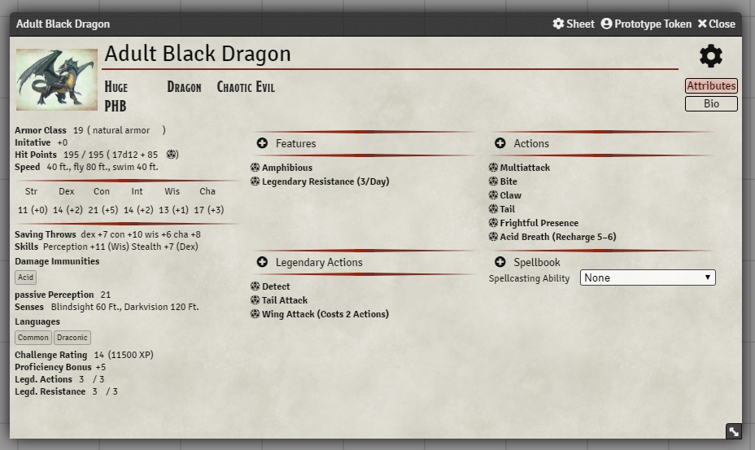

# Better NPC Sheet 5e

This module overwrites the default NPC sheet that comes shiped with the dnd5e system and brings it closer to the well known official template. 

## If you're having trouble closing the sheet, make sure to have both this module AND dnd5e on the most recent versions.
- better NPC sheet v0.9.2
- dnd5e v1.2.4

## The current version of the module has been tested with the following versions of FoundryVTT:
- 0.7.5
- 0.7.9
- 0.7.10

## Installation
1. Copy this link and use it in Foundrys Module Manager to install the Module

    > https://raw.githubusercontent.com/syl3r86/BetterNPCSheet5e/master/module.json
    
2. Enable the Module in your Worlds Module Settings

## Details
This sheet displays all the basic information that the default sheet displays, but in a more compact way in an effort to include as much extra information as possible. Feature, Weapon and Spell information are all displayable to show a description as well as a short summary of the attributes. All of this can be collapsed if not needed, though that colapsing is not persistent (meaning it will revert to default upon reloading of the sheet). Spells are so dense in information that they get collapsed by default, but they can be opened to display the information just like any other item.

Most of the Sheet information is directly editable even though it might not look like it, while Itemcontrolls are hidden by default. To see all options you can open the edit mode by clicking the cogwheel in the topright corner of the sheet. It will highlight all edit boxes and display all item menus for displayed items.

Since clicking the name of an item now toggles the item details, you have to use the d20 icon next to the name to roll an item. Abilitys, Saving Throws and Skills are still rollable by clicking the name.

Keep in mind that this module does not change anything on the rolling behaviour of Foundry VTT, you'll still get the popup to confirm normal rolls, advantage etc.

To save some space, any NPC that doesn't have any noncantrip spells will appear slimmer, but if you add a 1st level spell (or higher) the sheet will automaticly expand to full size to have enough space for spells.

If you have any suggestions or problems concerning this module, feel free to contact me in discord (Felix#6196) or per email (syl3r31@gmail.com).

## Contribution
Shoutout to DestinyGrey#2890 who incentivized the creation of this module.

If you feel like supporting my work, feel free to leave a tip at my paypal felix.mueller.86@web.de

## License
 Better NPC Sheet - a module for Foundry VTT - by <a xmlns:cc="http://creativecommons.org/ns#" href="https://github.com/syl3r86?tab=repositories" property="cc:attributionName" rel="cc:attributionURL">Felix Müller</a> is licensed under a <a rel="license" href="http://creativecommons.org/licenses/by/4.0/">Creative Commons Attribution 4.0 International License</a>.

This work is licensed under Foundry Virtual Tabletop [EULA - Limited License Agreement for module development v 0.3.8](http://foundryvtt.com/pages/license.html).
